# Access Rights

- **Diagram Type**: Custom
- **Package**: HomerSelect/BSL/Analysis Model/Payments/Outgoing payments/Process outgoing payments/Access Rights
- **Diagram ID**: 111325
- **Elements**: 16
- **Connectors**: 8

```mermaid
graph TD
    ADD_05_098_Create_outgoing_payment_on_external_request["{ADD}05.098 Create outgoing payment on external request"]
    MOD_05_098_Create_outgoing_payment_on_external_request["{MOD}05.098 Create outgoing payment on external request"]
    n_05_111_Generate_outgoing_payment_orders_automatically["05.111 Generate outgoing payment orders automatically"]
    MOD_05_111_Generate_outgoing_payment_orders_automatically["{MOD}05.111 Generate outgoing payment orders automatically"]
    n_05_092_MOD_Disburse_outgoing_payments_manually["05.092 {MOD}Disburse outgoing payments manually"]
    MOD_05_092_Disburse_outgoing_payments_manually["{MOD}05.092 Disburse outgoing payments manually"]
    n_05_091_Generate_outgoing_payment_insurance["05.091 Generate outgoing payment - insurance"]
    MOD_05_091_Generate_outgoing_payment_insurance["{MOD}05.091 Generate outgoing payment - insurance"]
    n_05_230_Process_outgoing_payments["05.230 Process outgoing payments"]
    n_05_110_Generate_payment_orders["05.110 Generate payment orders"]
    n_05_240_Cancel_outgoing_payments["05.240 Cancel outgoing payments"]
    MOD_05_110_Generate_payment_orders["{MOD}05.110 Generate payment orders"]
    MOD_05_230_Process_outgoing_payments["{MOD}05.230 Process outgoing payments"]
    MOD_05_240_Cancel_outgoing_payments["{MOD}05.240 Cancel outgoing payments"]
    MOD_05_090_Generate_outgoing_payment_for_contract["{MOD}05.090 Generate outgoing payment for contract"]
    n_05_090_Generate_outgoing_payment["05.090 Generate outgoing payment"]
    MOD_05_110_Generate_payment_orders -->|unnamed| n_05_110_Generate_payment_orders
    MOD_05_230_Process_outgoing_payments -->|unnamed| n_05_230_Process_outgoing_payments
    MOD_05_090_Generate_outgoing_payment_for_contract -->|unnamed| n_05_090_Generate_outgoing_payment
    MOD_05_240_Cancel_outgoing_payments -->|unnamed| n_05_240_Cancel_outgoing_payments
    MOD_05_091_Generate_outgoing_payment_insurance -->|unnamed| n_05_091_Generate_outgoing_payment_insurance
    MOD_05_098_Create_outgoing_payment_on_external_request -->|unnamed| ADD_05_098_Create_outgoing_payment_on_external_request
    MOD_05_111_Generate_outgoing_payment_orders_automatically -->|unnamed| n_05_111_Generate_outgoing_payment_orders_automatically
    n_05_092_MOD_Disburse_outgoing_payments_manually -->|unnamed| MOD_05_092_Disburse_outgoing_payments_manually
```

