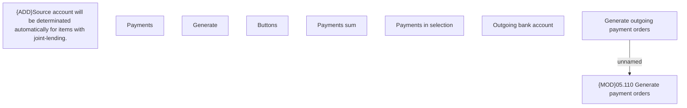

# Generate outgoing payment orders screen

- **Diagram Type**: Custom
- **Package**: HomerSelect/BSL/Analysis Model/Payments/Outgoing payments/Process outgoing payments/User Interface Model
- **Diagram ID**: 116270
- **Elements**: 11
- **Connectors**: 1

