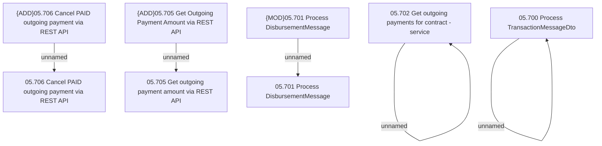

# Access Rights

- **Diagram Type**: Custom
- **Package**: HomerSelect/BSL/Analysis Model/Payments/Outgoing payments/Process requests for outgoing payments from external systems/Access Rights
- **Diagram ID**: 163411
- **Elements**: 10
- **Connectors**: 5

