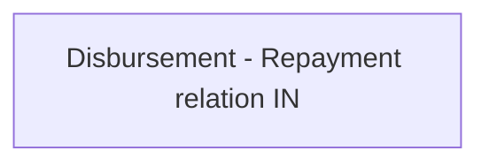

# Business rules IN

- **Diagram Type**: Custom
- **Package**: HomerSelect/BSL/Analysis Model/Payments/Payment Channels Management/COMMON for Payment Channel Management/Business Rules/IN
- **Diagram ID**: 137259
- **Elements**: 1
- **Connectors**: 0

