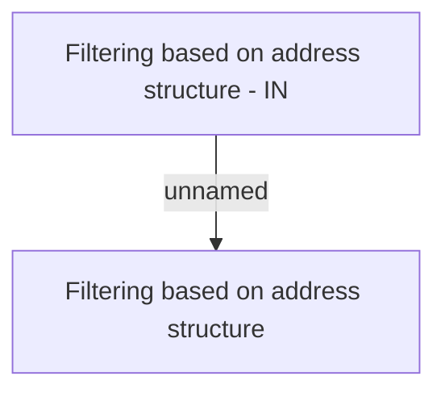

# Business rules

- **Diagram Type**: Custom
- **Package**: HomerSelect/BSL/Analysis Model/Payments/Payment Channels Management/COMMON for Payment Channel Management/Business Rules
- **Diagram ID**: 155937
- **Elements**: 2
- **Connectors**: 1

