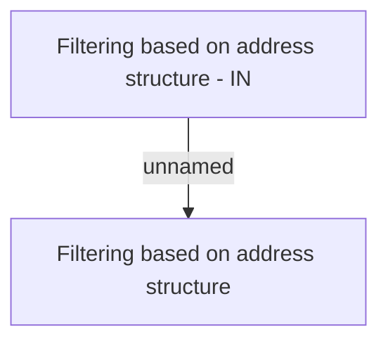

# Business rules

```mermaid
graph TD
    Filtering_based_on_address_structure_IN["Filtering based on address structure - IN"]
    Filtering_based_on_address_structure["Filtering based on address structure"]
    Filtering_based_on_address_structure_IN -->|unnamed| Filtering_based_on_address_structure
```
