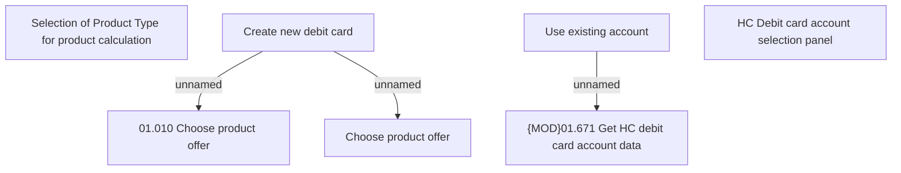

# HC Debit card account selection - panel

- **Diagram Type**: Custom
- **Package**: HomerSelect/BSL/Analysis Model/Payments/Payment Channels Management/COMMON for Payment Channel Management/User Interface Model
- **Diagram ID**: 146423
- **Elements**: 7
- **Connectors**: 3

