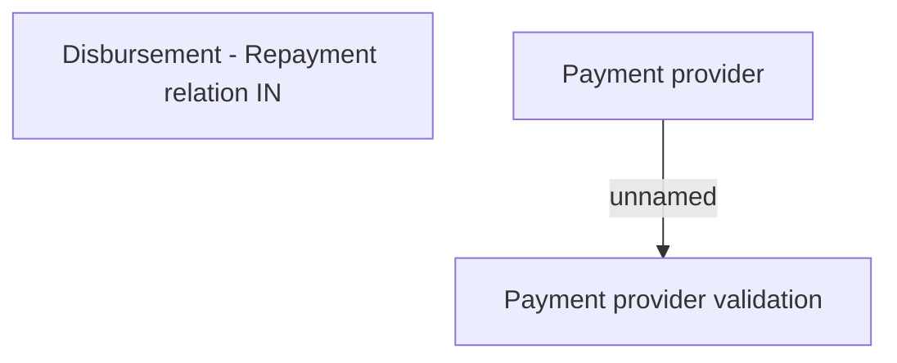

# Payment channel - validation rules

- **Diagram Type**: Custom
- **Package**: HomerSelect/BSL/Analysis Model/Payments/Payment Channels Management/COMMON for Payment Channel Management/Validation rules
- **Diagram ID**: 147639
- **Elements**: 3
- **Connectors**: 1

