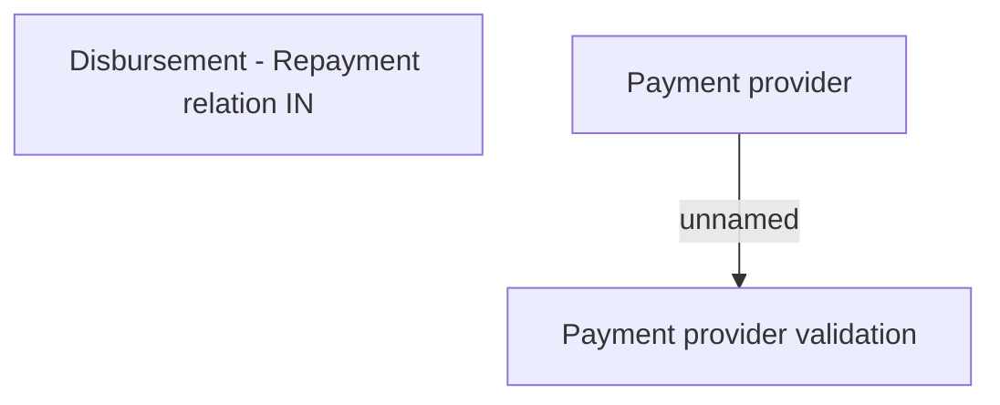

# Payment channel - validation rules

```mermaid
graph TD
    Disbursement_Repayment_relation_IN["Disbursement - Repayment relation IN"]
    Payment_provider_validation["Payment provider validation"]
    Payment_provider["Payment provider"]
    Payment_provider -->|unnamed| Payment_provider_validation
```
