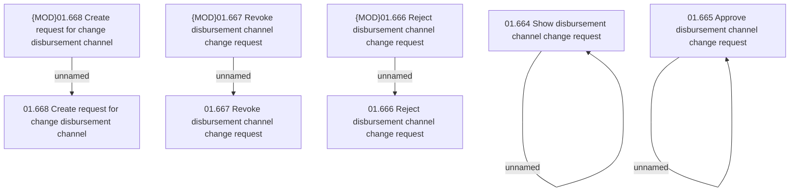

# Access Rights

- **Diagram Type**: Custom
- **Package**: HomerSelect/BSL/Analysis Model/Payments/Payment Channels Management/Disbursement channel change request processing/Access Rights
- **Diagram ID**: 98315
- **Elements**: 10
- **Connectors**: 5

