# Access Rights

- **Diagram Type**: Custom
- **Package**: HomerSelect/BSL/Analysis Model/Payments/Payment Channels Management/Disbursements channel management/Access Rights
- **Diagram ID**: 140184
- **Elements**: 18
- **Connectors**: 13

```mermaid
graph TD
    MOD_PAYM_6304_01_676_Verify_bank_account_data_for_contract_d["{MOD PAYM-6304} 01.676 Verify bank account data for contract disb. channel"]
    ADD_01_676_Verify_bank_account_data_for_contract_disb_channe["{ADD}01.676 Verify bank account data for contract disb. channel"]
    ADD_01_675_Verify_card_data_in_external_module_for_contract["{ADD}01.675 Verify card data in external module for contract"]
    n_01_675_Verify_card_data_in_external_module_for_contract["01.675 Verify card data in external module for contract"]
    n_01_674_Delete_card_data_in_external_module_for_contract["01.674 Delete card data in external module for contract"]
    ADD_01_674_Delete_card_data_in_external_module_for_contract["{ADD}01.674 Delete card data in external module for contract"]
    n_01_673_Save_card_data_to_external_module_for_contract["01.673 Save card data to external module for contract"]
    ADD_01_673_Save_card_data_to_external_module_for_contract["{ADD}01.673 Save card data to external module for contract"]
    ADD_01_662_Change_disbursement_channel_only_when_contract_is["{ADD}01.662 Change disbursement channel only when contract is active"]
    n_01_672_Create_external_current_account["01.672 Create external current account"]
    n_01_672_Create_external_current_account["01.672 Create external current account"]
    n_01_671_Get_HC_debit_card_account_data["01.671 Get HC debit card account data"]
    MOD_01_671_Get_HC_debit_card_account_data["{MOD}01.671 Get HC debit card account data"]
    n_01_662_Change_disbursement_channel_EXISTING["01.662 Change disbursement channel EXISTING"]
    n_01_662_Change_disbursement_channel["01.662 Change disbursement channel"]
    n_01_662_Change_disbursement_channel_BASIC["01.662 Change disbursement channel BASIC"]
    MOD_01_662_Change_disbursement_channel["{MOD}01.662 Change disbursement channel"]
    n_01_662_Change_disbursement_channel_EXTENDED["01.662 Change disbursement channel EXTENDED"]
    MOD_PAYM_6304_01_676_Verify_bank_account_data_for_contract_d -->|unnamed| ADD_01_676_Verify_bank_account_data_for_contract_disb_channe
    MOD_01_662_Change_disbursement_channel -->|unnamed| n_01_662_Change_disbursement_channel_EXTENDED
    MOD_01_662_Change_disbursement_channel -->|unnamed| n_01_673_Save_card_data_to_external_module_for_contract
    MOD_01_662_Change_disbursement_channel -->|unnamed| n_01_662_Change_disbursement_channel_BASIC
    MOD_01_662_Change_disbursement_channel -->|unnamed| ADD_01_662_Change_disbursement_channel_only_when_contract_is
    MOD_01_662_Change_disbursement_channel -->|unnamed| n_01_674_Delete_card_data_in_external_module_for_contract
    MOD_01_662_Change_disbursement_channel -->|unnamed| n_01_662_Change_disbursement_channel_EXISTING
    MOD_01_662_Change_disbursement_channel -->|unnamed| n_01_662_Change_disbursement_channel
    n_01_674_Delete_card_data_in_external_module_for_contract -->|unnamed| ADD_01_674_Delete_card_data_in_external_module_for_contract
    n_01_672_Create_external_current_account -->|unnamed| n_01_672_Create_external_current_account
    n_01_675_Verify_card_data_in_external_module_for_contract -->|unnamed| ADD_01_675_Verify_card_data_in_external_module_for_contract
    n_01_673_Save_card_data_to_external_module_for_contract -->|unnamed| ADD_01_673_Save_card_data_to_external_module_for_contract
    MOD_01_671_Get_HC_debit_card_account_data -->|unnamed| n_01_671_Get_HC_debit_card_account_data
```

