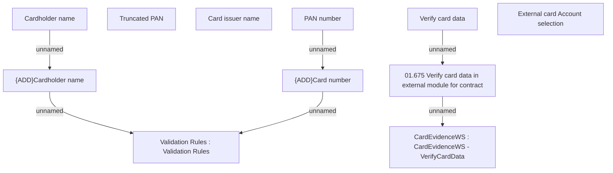

# External Card account selection - change disb. channel

```mermaid
graph TD
    CardEvidenceWS_CardEvidenceWS_VerifyCardData["CardEvidenceWS : CardEvidenceWS - VerifyCardData"]
    Cardholder_name["Cardholder name"]
    Validation_Rules_Validation_Rules["Validation Rules : Validation Rules"]
    ADD_Cardholder_name["{ADD}Cardholder name"]
    ADD_Card_number["{ADD}Card number"]
    n_01_675_Verify_card_data_in_external_module_for_contract["01.675 Verify card data in external module for contract"]
    Truncated_PAN["Truncated PAN"]
    Card_issuer_name["Card issuer name"]
    PAN_number["PAN number"]
    Verify_card_data["Verify card data"]
    External_card_Account_selection["External card Account selection"]
    Verify_card_data -->|unnamed| n_01_675_Verify_card_data_in_external_module_for_contract
    PAN_number -->|unnamed| ADD_Card_number
    Cardholder_name -->|unnamed| ADD_Cardholder_name
    ADD_Cardholder_name -->|unnamed| Validation_Rules_Validation_Rules
    ADD_Card_number -->|unnamed| Validation_Rules_Validation_Rules
    n_01_675_Verify_card_data_in_external_module_for_contract -->|unnamed| CardEvidenceWS_CardEvidenceWS_VerifyCardData
```
