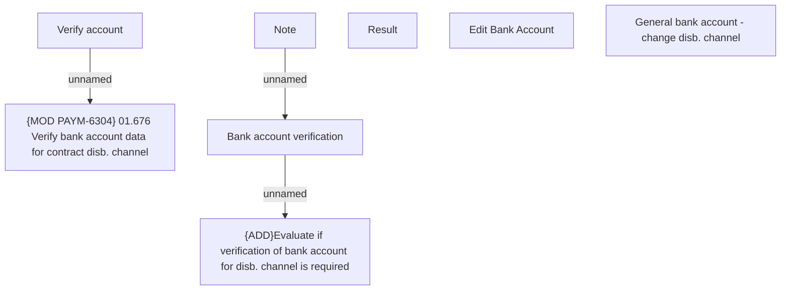

# General bank account - change disb. channel

```mermaid
graph TD
    el_1873886["Note"]
    ADD_Evaluate_if_verification_of_bank_account_for_disb_channe["{ADD}Evaluate if verification of bank account for disb. channel is required"]
    MOD_PAYM_6304_01_676_Verify_bank_account_data_for_contract_d["{MOD PAYM-6304} 01.676 Verify bank account data for contract disb. channel"]
    Verify_account["Verify account"]
    Result["Result"]
    Bank_account_verification["Bank account verification"]
    Edit_Bank_Account["Edit Bank Account"]
    General_bank_account_change_disb_channel["General bank account - change disb. channel"]
    el_1873886 -->|unnamed| Bank_account_verification
    Verify_account -->|unnamed| MOD_PAYM_6304_01_676_Verify_bank_account_data_for_contract_d
    Bank_account_verification -->|unnamed| ADD_Evaluate_if_verification_of_bank_account_for_disb_channe
```
