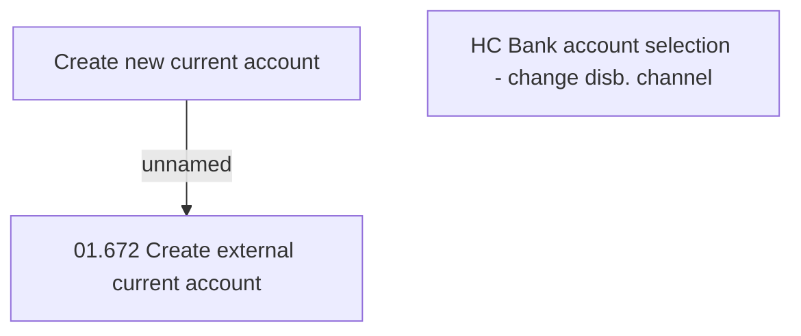

# HC Bank account selection - change disb. channel

- **Diagram Type**: Custom
- **Package**: HomerSelect/BSL/Analysis Model/Payments/Payment Channels Management/Disbursements channel management/User Interface Model
- **Diagram ID**: 163933
- **Elements**: 3
- **Connectors**: 1

