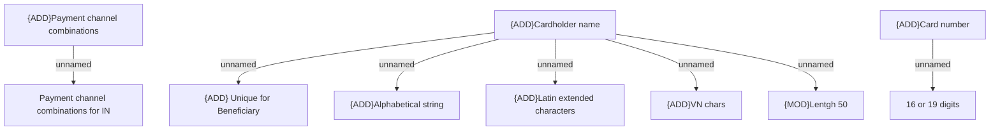

# Validation Rules

```mermaid
graph TD
    ADD_Unique_for_Beneficiary["{ADD} Unique for Beneficiary
"]
    Payment_channel_combinations_for_IN["Payment channel combinations for IN"]
    ADD_Payment_channel_combinations["{ADD}Payment channel combinations"]
    ADD_Cardholder_name["{ADD}Cardholder name"]
    ADD_Card_number["{ADD}Card number"]
    MOD_Lentgh_50["{MOD}Lentgh 50"]
    ADD_VN_chars["{ADD}VN chars"]
    ADD_Latin_extended_characters["{ADD}Latin extended characters"]
    ADD_Alphabetical_string["{ADD}Alphabetical string"]
    n_16_or_19_digits["16 or 19 digits"]
    ADD_Cardholder_name -->|unnamed| ADD_Unique_for_Beneficiary
    ADD_Card_number -->|unnamed| n_16_or_19_digits
    ADD_Cardholder_name -->|unnamed| ADD_Alphabetical_string
    ADD_Cardholder_name -->|unnamed| ADD_Latin_extended_characters
    ADD_Cardholder_name -->|unnamed| ADD_VN_chars
    ADD_Cardholder_name -->|unnamed| MOD_Lentgh_50
    ADD_Payment_channel_combinations -->|unnamed| Payment_channel_combinations_for_IN
```
