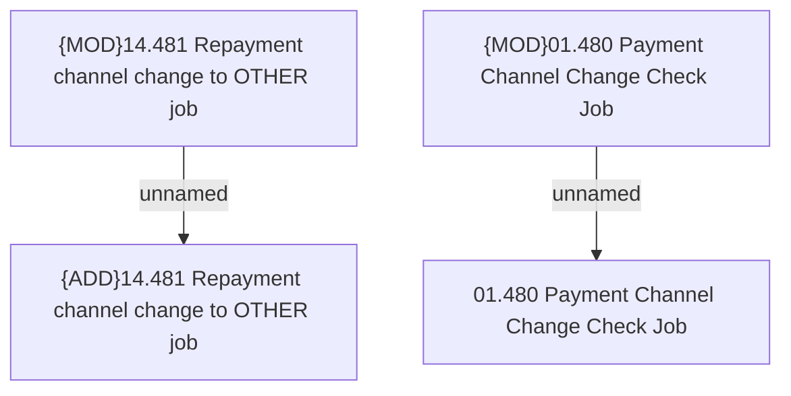

# Access Rights

```mermaid
graph TD
    MOD_14_481_Repayment_channel_change_to_OTHER_job["{MOD}14.481 Repayment channel change to OTHER job"]
    ADD_14_481_Repayment_channel_change_to_OTHER_job["{ADD}14.481 Repayment channel change to OTHER job"]
    MOD_01_480_Payment_Channel_Change_Check_Job["{MOD}01.480 Payment Channel Change Check Job"]
    n_01_480_Payment_Channel_Change_Check_Job["01.480 Payment Channel Change Check Job"]
    MOD_14_481_Repayment_channel_change_to_OTHER_job -->|unnamed| ADD_14_481_Repayment_channel_change_to_OTHER_job
    MOD_01_480_Payment_Channel_Change_Check_Job -->|unnamed| n_01_480_Payment_Channel_Change_Check_Job
```
