# Access Rights

- **Diagram Type**: Custom
- **Package**: HomerSelect/BSL/Analysis Model/Payments/Payment Channels Management/Payment Channels via WS/Access Rights
- **Diagram ID**: 132828
- **Elements**: 12
- **Connectors**: 5

```mermaid
graph TD
    ADD_05_330_Get_Payment_Channel_via_REST_API["{ADD}05.330 Get Payment Channel via REST API"]
    ADD_05_331_Create_And_Validate_Payment_Channel_via_REST_API["{ADD}05.331 Create And Validate Payment Channel via REST API"]
    ADD_05_324_Validate_Payment_Channel["{ADD}05.324 Validate Payment Channel"]
    ADD_05_324_Validate_Payment_Channel["{ADD}05.324 Validate Payment Channel "]
    ADD_05_323_Get_payment_channel_by_bank_account_data_on_exter["{ADD}05.323 Get payment channel by bank account data on external request"]
    ADD_05_323_Get_payment_channel_by_bank_account_data_on_exter["{ADD}05.323 Get payment channel by bank account data on external request"]
    ADD_05_322_Get_payment_channel_on_external_request["{ADD}05.322 Get payment channel on external request"]
    n_05_322_Get_payment_channel_on_external_request["05.322 Get payment channel on external request"]
    ADD_05_321_Update_payment_channel_on_external_request["{ADD}05.321 Update payment channel on external request"]
    MOD_05_321_Update_payment_channel_on_external_request["{MOD}05.321 Update payment channel on external request"]
    ADD_05_320_Create_payment_channel_on_external_request["{ADD}05.320 Create payment channel on external request"]
    MOD_05_320_Create_payment_channel_on_external_request["{MOD}05.320 Create payment channel on external request"]
    MOD_05_320_Create_payment_channel_on_external_request -->|unnamed| ADD_05_320_Create_payment_channel_on_external_request
    ADD_05_323_Get_payment_channel_by_bank_account_data_on_exter -->|unnamed| ADD_05_323_Get_payment_channel_by_bank_account_data_on_exter
    n_05_322_Get_payment_channel_on_external_request -->|unnamed| ADD_05_322_Get_payment_channel_on_external_request
    MOD_05_321_Update_payment_channel_on_external_request -->|unnamed| ADD_05_321_Update_payment_channel_on_external_request
    ADD_05_324_Validate_Payment_Channel -->|unnamed| ADD_05_324_Validate_Payment_Channel
```

