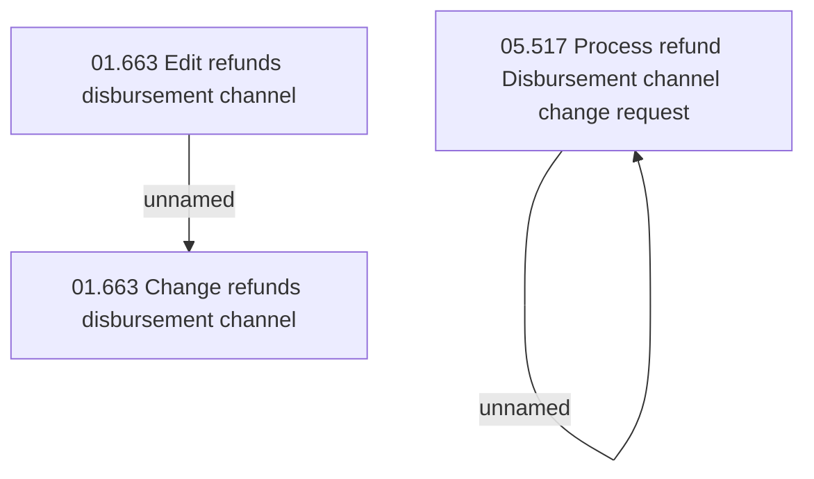

# Access Rights

- **Diagram Type**: Custom
- **Package**: HomerSelect/BSL/Analysis Model/Payments/Payment Channels Management/Refunds disbursement channel management/Access Rights
- **Diagram ID**: 152758
- **Elements**: 4
- **Connectors**: 2

