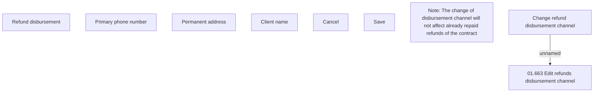

# Change refund disbursement channel

```mermaid
graph TD
    Refund_disbursement["Refund disbursement"]
    n_01_663_Edit_refunds_disbursement_channel["01.663 Edit refunds disbursement channel"]
    Primary_phone_number["Primary phone number"]
    Permanent_address["Permanent address"]
    Client_name["Client name"]
    Cancel["Cancel"]
    Save["Save"]
    Note_The_change_of_disbursement_channel_will_not_affect_alre["Note: The change of disbursement channel will not affect already repaid refunds of the contract"]
    Change_refund_disbursement_channel["Change refund disbursement channel"]
    Change_refund_disbursement_channel -->|unnamed| n_01_663_Edit_refunds_disbursement_channel
```
