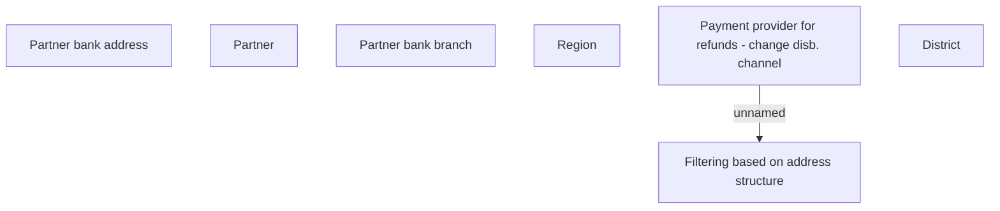

# Payment provider for refunds

- **Diagram Type**: Custom
- **Package**: HomerSelect/BSL/Analysis Model/Payments/Payment Channels Management/Refunds disbursement channel management/User Interface Model
- **Diagram ID**: 100624
- **Elements**: 7
- **Connectors**: 1

