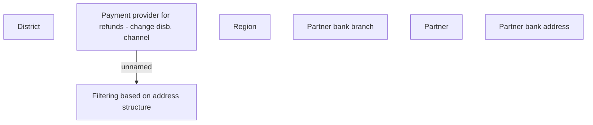

# Payment provider for refunds

```mermaid
graph TD
    Filtering_based_on_address_structure["Filtering based on address structure"]
    District["District"]
    Payment_provider_for_refunds_change_disb_channel["Payment provider for refunds - change disb. channel"]
    Region["Region"]
    Partner_bank_branch["Partner bank branch"]
    Partner["Partner"]
    Partner_bank_address["Partner bank address"]
    Payment_provider_for_refunds_change_disb_channel -->|unnamed| Filtering_based_on_address_structure
```
