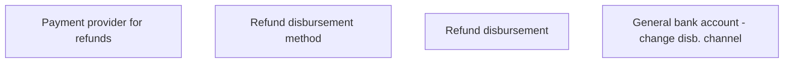

# Refund disbursement

```mermaid
graph TD
    Payment_provider_for_refunds["Payment provider for refunds"]
    Refund_disbursement_method["Refund disbursement method"]
    Refund_disbursement["Refund disbursement"]
    General_bank_account_change_disb_channel["General bank account - change disb. channel"]
```
