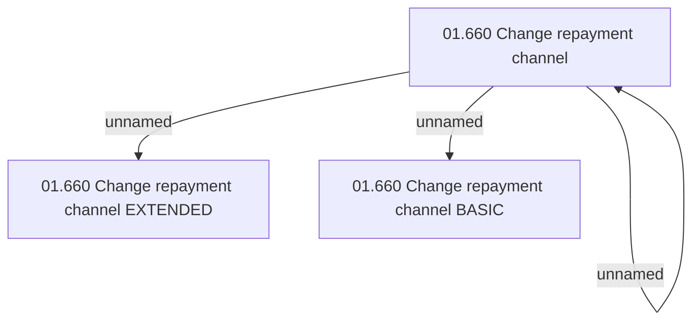

# Access Rights

```mermaid
graph TD
    n_01_660_Change_repayment_channel["01.660 Change repayment channel"]
    n_01_660_Change_repayment_channel_EXTENDED["01.660 Change repayment channel EXTENDED"]
    n_01_660_Change_repayment_channel_BASIC["01.660 Change repayment channel BASIC"]
    n_01_660_Change_repayment_channel["01.660 Change repayment channel"]
    n_01_660_Change_repayment_channel -->|unnamed| n_01_660_Change_repayment_channel_EXTENDED
    n_01_660_Change_repayment_channel -->|unnamed| n_01_660_Change_repayment_channel
    n_01_660_Change_repayment_channel -->|unnamed| n_01_660_Change_repayment_channel_BASIC
```
