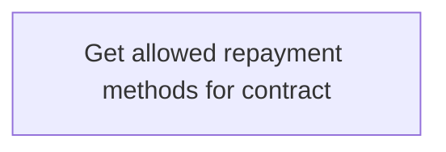

# Business rules

- **Diagram Type**: Custom
- **Package**: HomerSelect/BSL/Analysis Model/Payments/Payment Channels Management/Repayments channel management/Business rules
- **Diagram ID**: 140178
- **Elements**: 1
- **Connectors**: 0

