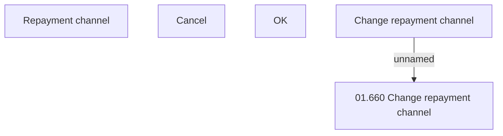

# Change repayment channels

```mermaid
graph TD
    Repayment_channel["Repayment channel"]
    n_01_660_Change_repayment_channel["01.660 Change repayment channel"]
    Cancel["Cancel"]
    OK["OK"]
    Change_repayment_channel["Change repayment channel"]
    Change_repayment_channel -->|unnamed| n_01_660_Change_repayment_channel
```
