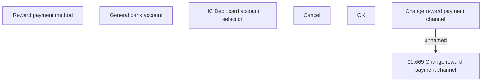

# Rewards payment channel management

- **Diagram Type**: Custom
- **Package**: HomerSelect/BSL/Analysis Model/Payments/Payment Channels Management/Rewards payment channel management/User Interface Model
- **Diagram ID**: 133380
- **Elements**: 7
- **Connectors**: 1

