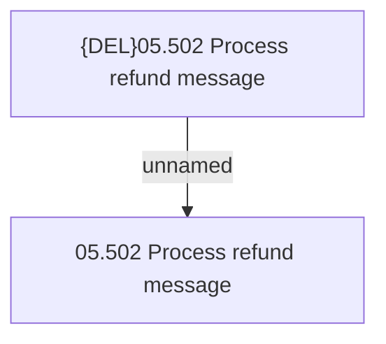

# Access Rights

- **Diagram Type**: Custom
- **Package**: HomerSelect/BSL/Analysis Model/Payments/Refunds/Process refund message/Access Rights
- **Diagram ID**: 63332
- **Elements**: 2
- **Connectors**: 1

