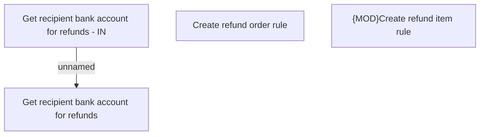

# Business Rules

```mermaid
graph TD
    Get_recipient_bank_account_for_refunds_IN["Get recipient bank account for refunds - IN"]
    Get_recipient_bank_account_for_refunds["Get recipient bank account for refunds"]
    Create_refund_order_rule["Create refund order rule"]
    MOD_Create_refund_item_rule["{MOD}Create refund item rule"]
    Get_recipient_bank_account_for_refunds_IN -->|unnamed| Get_recipient_bank_account_for_refunds
```
