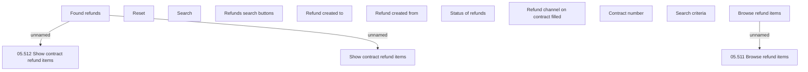

# Browse refunds

- **Diagram Type**: Custom
- **Package**: HomerSelect/BSL/Analysis Model/Payments/Refunds/Refund management/User Interface Model/Browse refunds
- **Diagram ID**: 161004
- **Elements**: 14
- **Connectors**: 3

