# Process outgoing payment for refunds

- **Diagram Type**: Custom
- **Package**: HomerSelect/BSL/Analysis Model/Payments/Refunds/Refund management/User Interface Model/Process outgoing payment for refunds
- **Diagram ID**: 111110
- **Elements**: 30
- **Connectors**: 8

```mermaid
graph TD
    n_05_050_Show_incoming_payment_detail["05.050 Show incoming payment detail"]
    Time_to_delivery_to_minutes["Time to delivery - to (minutes)"]
    Time_to_delivery_to_hours["Time to delivery - to (hours)"]
    Time_to_delivery_from_minutes["Time to delivery - from (minutes)"]
    Time_to_delivery_from_hours["Time to delivery - from (hours)"]
    Primary_document_number["Primary document number"]
    Primary_document_type["Primary document type"]
    Primary_phone_number["Primary phone number"]
    Permanent_address["Permanent address"]
    Client_full_name["Client full name"]
    Additional_information_for_PBA_pamyent_channel["Additional information for PBA pamyent channel"]
    Additional_information_for_PBA_pamyent_channel["Additional information for PBA pamyent channel"]
    n_05_516_Cancel_unpaid_outgoing_payment_for_refund["05.516 Cancel unpaid outgoing payment for refund"]
    n_05_515_Generate_outgoing_payment_for_refund_items["05.515 Generate outgoing payment for refund items"]
    Incoming_payment_detail["Incoming payment detail"]
    Show_contract_refunds["Show contract refunds"]
    n_05_512_Show_contract_refund_items["05.512 Show contract refund items"]
    Show_contract_refunds["Show contract refunds"]
    n_05_513_Process_outgoing_payment_for_refund_items["05.513 Process outgoing payment for refund items"]
    List_of_refunds["List of refunds"]
    Comment["Comment"]
    Payment_status["Payment status"]
    Payment_generated_on["Payment generated on"]
    Amount_to_refund["Amount to refund"]
    Contract_number["Contract number"]
    Show_contract_refund_items["Show contract refund items"]
    Cancel_payment["Cancel payment"]
    Generate_payment["Generate payment"]
    Process_outgoing_payment_for_refunds_buttons["Process outgoing payment for refunds buttons"]
    Process_outgoing_payment_for_refund_items["Process outgoing payment for refund items"]
    Process_outgoing_payment_for_refund_items -->|unnamed| n_05_513_Process_outgoing_payment_for_refund_items
    Generate_payment -->|unnamed| Show_contract_refunds
    Generate_payment -->|unnamed| n_05_515_Generate_outgoing_payment_for_refund_items
    Cancel_payment -->|unnamed| n_05_516_Cancel_unpaid_outgoing_payment_for_refund
    Show_contract_refund_items -->|unnamed| Show_contract_refunds
    Show_contract_refund_items -->|unnamed| n_05_512_Show_contract_refund_items
    List_of_refunds -->|unnamed| Incoming_payment_detail
    Show_contract_refunds -->|unnamed| Process_outgoing_payment_for_refund_items
```

