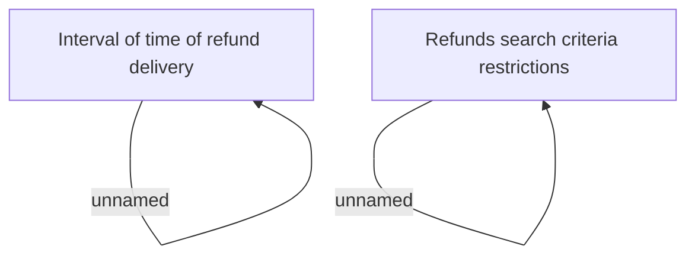

# Validation rules

- **Diagram Type**: Custom
- **Package**: HomerSelect/BSL/Analysis Model/Payments/Refunds/Refund management/Validation rules
- **Diagram ID**: 45750
- **Elements**: 4
- **Connectors**: 2

