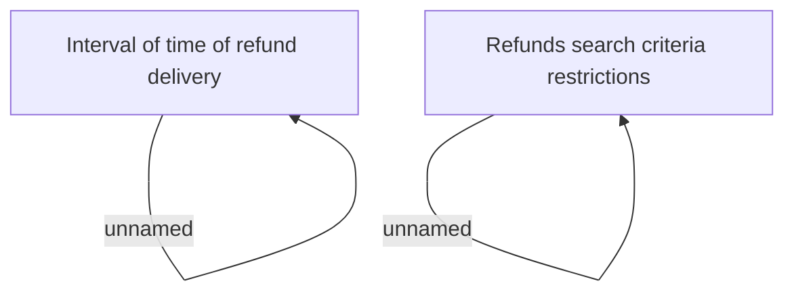

# Validation rules

```mermaid
graph TD
    Interval_of_time_of_refund_delivery["Interval of time of refund delivery"]
    Interval_of_time_of_refund_delivery["Interval of time of refund delivery"]
    Refunds_search_criteria_restrictions["Refunds search criteria restrictions"]
    Refunds_search_criteria_restrictions["Refunds search criteria restrictions"]
    Refunds_search_criteria_restrictions -->|unnamed| Refunds_search_criteria_restrictions
    Interval_of_time_of_refund_delivery -->|unnamed| Interval_of_time_of_refund_delivery
```
