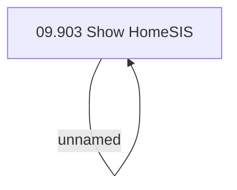

# Access Right

- **Diagram Type**: Custom
- **Package**: HomerSelect/BSL/Analysis Model/Sales Network Management/COMMON for Sales Network Management/Run HomeSIS application/Access Right
- **Diagram ID**: 39187
- **Elements**: 2
- **Connectors**: 1

