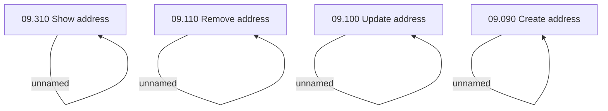

# Access Rights

- **Diagram Type**: Custom
- **Package**: HomerSelect/BSL/Analysis Model/Sales Network Management/COMMON for Sales Network Management/SN Address/Access Rights
- **Diagram ID**: 97933
- **Elements**: 8
- **Connectors**: 4

