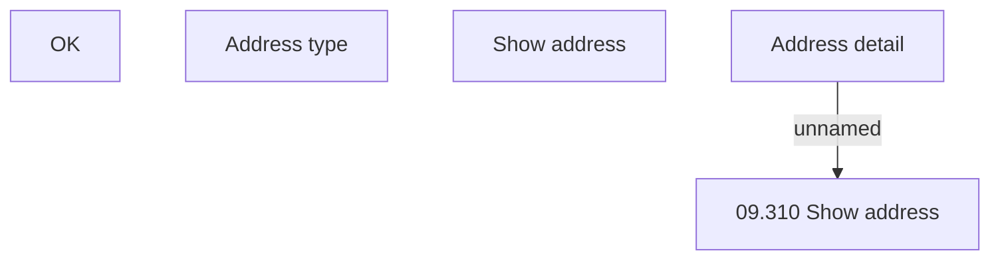

# Show address detail 

- **Diagram Type**: Custom
- **Package**: HomerSelect/BSL/Analysis Model/Sales Network Management/COMMON for Sales Network Management/SN Address/User Interface
- **Diagram ID**: 71988
- **Elements**: 5
- **Connectors**: 1

