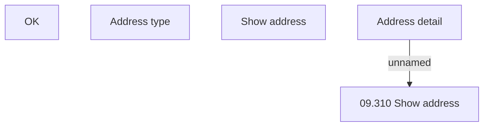

# Show address detail 

```mermaid
graph TD
    OK["OK"]
    Address_type["Address type"]
    Show_address["Show address"]
    n_09_310_Show_address["09.310 Show address"]
    Address_detail["Address detail"]
    Address_detail -->|unnamed| n_09_310_Show_address
```
