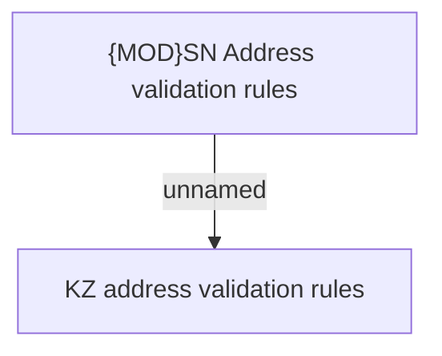

# SN Address validation rules

- **Diagram Type**: Custom
- **Package**: HomerSelect/BSL/Analysis Model/Sales Network Management/COMMON for Sales Network Management/SN Address/Validation rules
- **Diagram ID**: 82102
- **Elements**: 2
- **Connectors**: 1

