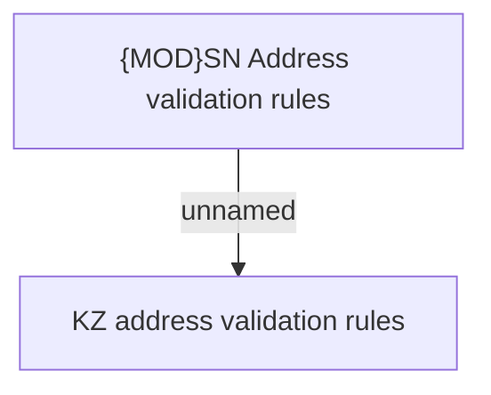

# SN Address validation rules

```mermaid
graph TD
    KZ_address_validation_rules["KZ address validation rules"]
    MOD_SN_Address_validation_rules["{MOD}SN Address validation rules"]
    MOD_SN_Address_validation_rules -->|unnamed| KZ_address_validation_rules
```
