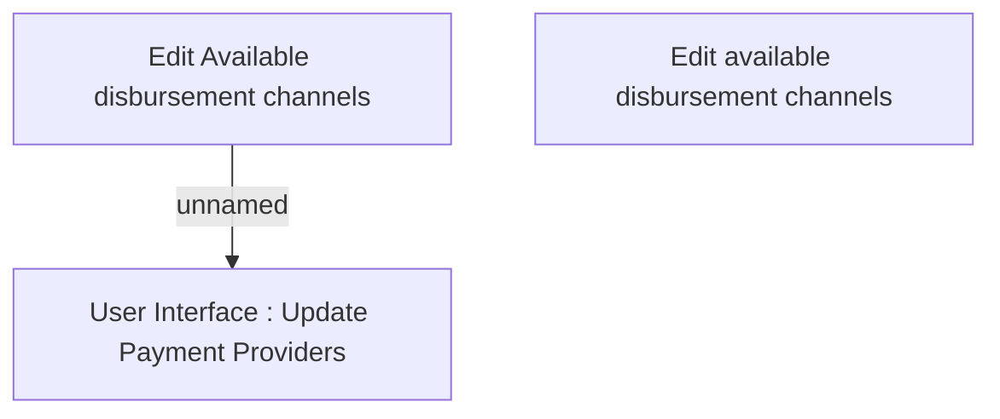

# Edit available disbursement channels

```mermaid
graph TD
    User_Interface_Update_Payment_Providers["User Interface : Update Payment Providers"]
    Edit_Available_disbursement_channels["Edit Available disbursement channels"]
    Edit_available_disbursement_channels["Edit available disbursement channels"]
    Edit_Available_disbursement_channels -->|unnamed| User_Interface_Update_Payment_Providers
```
