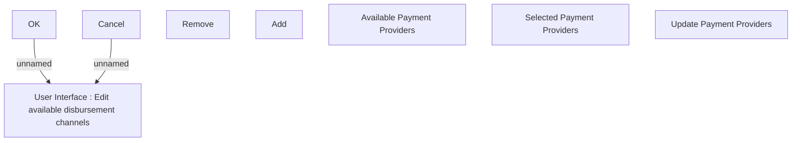

# Update Payment Providers

- **Diagram Type**: Custom
- **Package**: HomerSelect/BSL/Analysis Model/Sales Network Management/COMMON for Sales Network Management/SN Available disbursement channel/User Interface
- **Diagram ID**: 104522
- **Elements**: 8
- **Connectors**: 2

