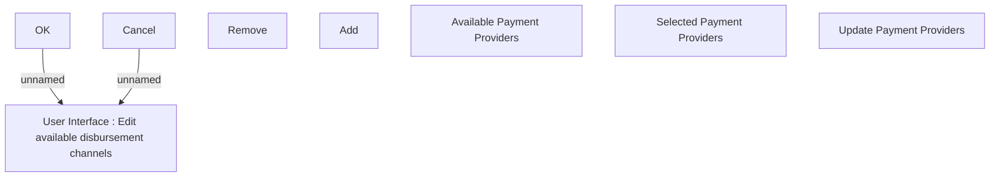

# Update Payment Providers

```mermaid
graph TD
    User_Interface_Edit_available_disbursement_channels["User Interface : Edit available disbursement channels"]
    Cancel["Cancel"]
    OK["OK"]
    Remove["Remove"]
    Add["Add"]
    Available_Payment_Providers["Available Payment Providers"]
    Selected_Payment_Providers["Selected Payment Providers"]
    Update_Payment_Providers["Update Payment Providers"]
    OK -->|unnamed| User_Interface_Edit_available_disbursement_channels
    Cancel -->|unnamed| User_Interface_Edit_available_disbursement_channels
```
