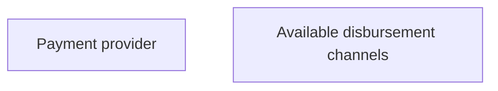

# Validation rules

- **Diagram Type**: Custom
- **Package**: HomerSelect/BSL/Analysis Model/Sales Network Management/COMMON for Sales Network Management/SN Available disbursement channel/Validation rules
- **Diagram ID**: 39266
- **Elements**: 2
- **Connectors**: 0

