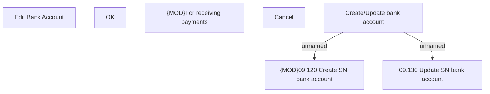

# Create/Update bank account

```mermaid
graph TD
    Edit_Bank_Account["Edit Bank Account"]
    OK["OK"]
    MOD_For_receiving_payments["{MOD}For receiving payments"]
    Cancel["Cancel"]
    n_09_130_Update_SN_bank_account["09.130 Update SN bank account"]
    MOD_09_120_Create_SN_bank_account["{MOD}09.120 Create SN bank account"]
    Create_Update_bank_account["Create/Update bank account"]
    Create_Update_bank_account -->|unnamed| MOD_09_120_Create_SN_bank_account
    Create_Update_bank_account -->|unnamed| n_09_130_Update_SN_bank_account
```
