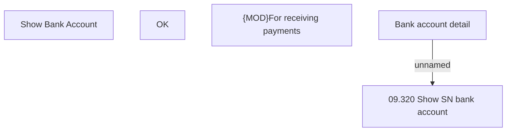

# Show bank account detail 

```mermaid
graph TD
    Show_Bank_Account["Show Bank Account"]
    OK["OK"]
    MOD_For_receiving_payments["{MOD}For receiving payments"]
    n_09_320_Show_SN_bank_account["09.320 Show SN bank account"]
    Bank_account_detail["Bank account detail"]
    Bank_account_detail -->|unnamed| n_09_320_Show_SN_bank_account
```
