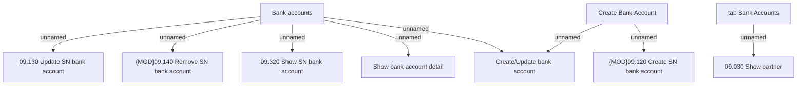

# tab Bank Accounts

```mermaid
graph TD
    Create_Update_bank_account["Create/Update bank account"]
    Show_bank_account_detail["Show bank account detail "]
    Bank_accounts["Bank accounts"]
    n_09_030_Show_partner["09.030 Show partner"]
    n_09_320_Show_SN_bank_account["09.320 Show SN bank account"]
    MOD_09_140_Remove_SN_bank_account["{MOD}09.140 Remove SN bank account"]
    n_09_130_Update_SN_bank_account["09.130 Update SN bank account"]
    MOD_09_120_Create_SN_bank_account["{MOD}09.120 Create SN bank account"]
    Create_Bank_Account["Create Bank Account"]
    tab_Bank_Accounts["tab Bank Accounts"]
    Create_Bank_Account -->|unnamed| MOD_09_120_Create_SN_bank_account
    Bank_accounts -->|unnamed| n_09_130_Update_SN_bank_account
    Bank_accounts -->|unnamed| MOD_09_140_Remove_SN_bank_account
    Bank_accounts -->|unnamed| n_09_320_Show_SN_bank_account
    tab_Bank_Accounts -->|unnamed| n_09_030_Show_partner
    Bank_accounts -->|unnamed| Show_bank_account_detail
    Bank_accounts -->|unnamed| Create_Update_bank_account
    Create_Bank_Account -->|unnamed| Create_Update_bank_account
```
