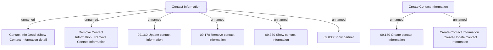

# Contact Information Tab

```mermaid
graph TD
    n_09_030_Show_partner["09.030 Show partner"]
    n_09_330_Show_contact_information["09.330 Show contact information"]
    n_09_170_Remove_contact_information["09.170 Remove contact information"]
    n_09_160_Update_contact_information["09.160 Update contact information"]
    Remove_Contact_Information_Remove_Contact_Information["Remove Contact Information : Remove Contact Information"]
    Create_Contact_Information_Create_Update_Contact_Information["Create Contact Information  :Create/Update Contact Information"]
    Contact_Info_Detail_Show_Contact_Information_detail["Contact Info Detail :Show Contact Information detail"]
    n_09_150_Create_contact_information["09.150 Create contact information"]
    Contact_Information["Contact Information "]
    Create_Contact_Information["Create Contact Information"]
    Contact_Information["Contact Information"]
    Create_Contact_Information -->|unnamed| n_09_150_Create_contact_information
    Contact_Information -->|unnamed| Contact_Info_Detail_Show_Contact_Information_detail
    Create_Contact_Information -->|unnamed| Create_Contact_Information_Create_Update_Contact_Information
    Contact_Information -->|unnamed| Remove_Contact_Information_Remove_Contact_Information
    Contact_Information -->|unnamed| n_09_160_Update_contact_information
    Contact_Information -->|unnamed| n_09_170_Remove_contact_information
    Contact_Information -->|unnamed| n_09_330_Show_contact_information
    Contact_Information -->|unnamed| n_09_030_Show_partner
```
