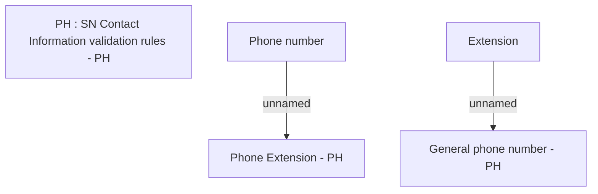

# Create Phone Contacts - PH

- **Diagram Type**: Custom
- **Package**: HomerSelect/BSL/Analysis Model/Sales Network Management/COMMON for Sales Network Management/SN Contact Information/User Interface/Create Phone Contacts/PH
- **Diagram ID**: 72030
- **Elements**: 5
- **Connectors**: 2

