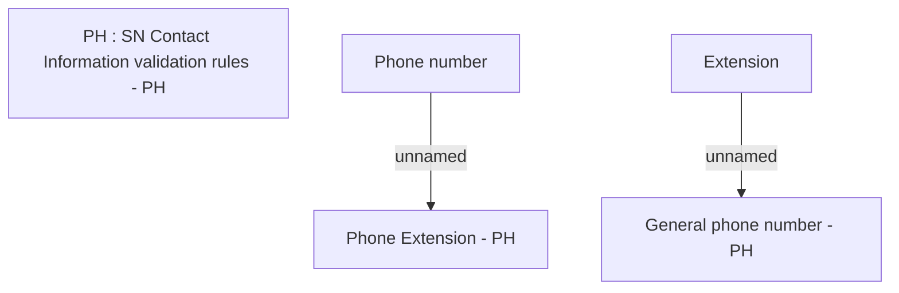

# Create Phone Contacts - PH

```mermaid
graph TD
    PH_SN_Contact_Information_validation_rules_PH["PH : SN Contact Information validation rules - PH"]
    Phone_number["Phone number"]
    Extension["Extension"]
    General_phone_number_PH["General phone number - PH"]
    Phone_Extension_PH["Phone Extension - PH"]
    Extension -->|unnamed| General_phone_number_PH
    Phone_number -->|unnamed| Phone_Extension_PH
```
