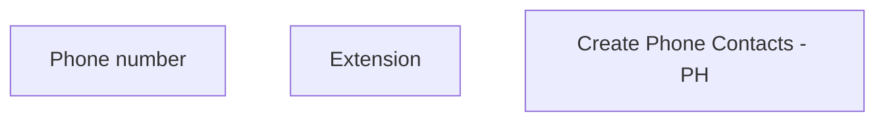

# Create Phone Contacts

- **Diagram Type**: Custom
- **Package**: HomerSelect/BSL/Analysis Model/Sales Network Management/COMMON for Sales Network Management/SN Contact Information/User Interface/Create Phone Contacts
- **Diagram ID**: 72036
- **Elements**: 3
- **Connectors**: 0

