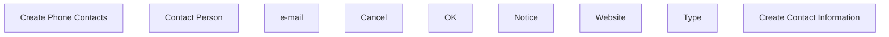

# Create/Update Contact Information

```mermaid
graph TD
    Create_Phone_Contacts["Create Phone Contacts"]
    Contact_Person["Contact Person"]
    e_mail["e-mail"]
    Cancel["Cancel"]
    OK["OK"]
    Notice["Notice"]
    Website["Website"]
    Type["Type"]
    Create_Contact_Information["Create Contact Information"]
```
